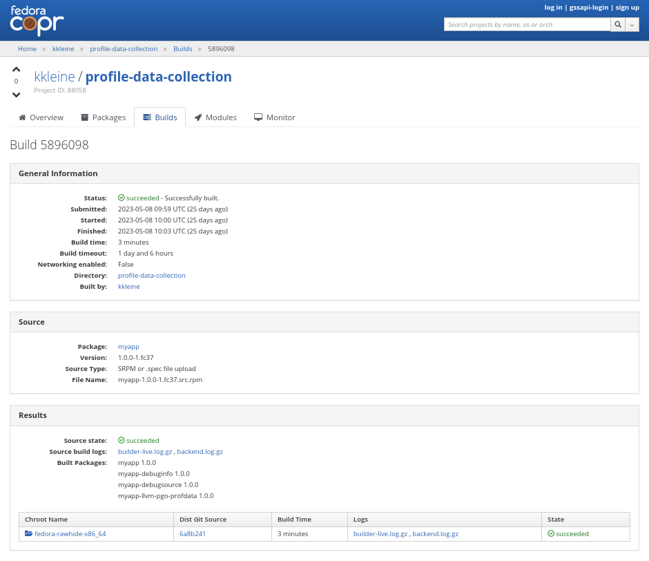

// Process this file with "make docs" before viewing
include::preamble.adoc[]

[.lead]
In this experiment we generate PGO profile data from compiling unmodified RPM packages with a PGO instrumented LLVM and feed those profiles into a PGO optimized rebuild of LLVM. Please note, that this experiment is not continued.

== Overview

We create an instrumented LLVM toolchain in a Copr project called {link-llvm-pgo-instrumented}. In another Copr project called {link-profile-data-collection} we install a new package called `llvm-pgo-instrumented-macros` into the chroot buildroot. Every package that gets built in that buildroot will automatically produce a subpackage `<PACKAGE>-llvm-pgo-profdata` with LLVM PGO profile data. We demonstrate this with a simple "Hello, World!" application that is called `myapp`. We then collect all generated subpackages through `BuildRequires:` tags in another package called `llvm-pgo-profdata`. During the build of this `llvm-pgo-profdata` package, all profiles are merged into an indexed profile data file. The final `llvm-pgo-profdata` RPM then installs the indexed profile data file into a location from which a PGO optimized build of LLVM can read it. This PGO optimized build of the LLVM toolchain is done in a third Copr project called {link-llvm-pgo-optimized}.

// image::process-overview.png[]

=== Non-goals

It is not a goal to get a perfectly tweaked PGO optimization build of LLVM. Instead we want to explore a way how to setup a pipeline in {link-copr} for further tweaking and experimentation.

It is also not a goal to change from the standalone build mode to a mono-repo build with a single buildroot. But rest assured, we're looking into merging the `llvm` and `clang` RPM packages into one so that we can apply PGO and LTO in a more holistic way.

The only operating system that we build for in this experiment is Fedora rawhide on x86_64.

// NOTE: This is potentially a bit risky because the the profile data may become irrelevant more quickly compared to less frequently updated variants of Fedora. But rawhide is the version of choice for introducing new profiles.

== Understand what PGO can do

> PGO (Profile-Guided Optimization) allows your compiler to better optimize code for how it actually runs. Users report that applying this to Clang and LLVM can decrease overall compile time by 20%.
(link:https://llvm.org/docs/HowToBuildWithPGO.html#introduction[Source])

> Profile information enables better optimization. For example, knowing that a branch is taken very frequently helps the compiler make better decisions when ordering basic blocks. Knowing that a function `foo` is called more frequently than another function `bar` helps the inliner. Optimization levels `-O2` and above are recommended for use of profile guided optimization. [...] [Be] careful to collect profiles by running your code with inputs that are representative of the typical behavior. Code that is not exercised in the profile will be optimized as if it is unimportant, and the compiler may make poor optimization choices for code that is disproportionately used while profiling.
(link:https://clang.llvm.org/docs/UsersManual.html#profile-guided-optimization[Source])

For the {link-fedora} distribution we build a ton of packages with LLVM. The aforementioned *inputs* are these packages themselves. The programs to optimize are those under the LLVM umbrella (e.g. `clang`).

The question is: How can we tap in the RPM build pipeline using {link-copr} and build RPM packages without modifying their `*.spec` files manually?

I've created a multi-step experiment that shows how this can be achieved. For educational purposes I've written many of the steps using `Containerfile` s. This allows for a good level of isolation when you want to build the steps on your own. To run any of the steps on your own, navigate to the step directory and run `make all`, for example:

[source,console]
----
$ cd step1-myapp
$ make all
----

But make sure you first read the description for each step below. Sometimes a step really only serves a documentation purpose and it isn't necessary that you build it on your own. 

NOTE: The Containerfiles run as `root`. Afterall the resulting images are not meant for anything but demonstration purposes and MUST NOT be used in production sites.

=== How to follow along?

I've been writing and testing everything on a {link-fedora} 37 laptop.

Here's a good starting point for preparing your system if you want to follow along. Don't worry we don't install any custom RPM on your system. Everything is build either in a podman container or on {link-copr}.

[source,console]
----
$ sudo dnf install -y git make fedpkg podman fedora-packager krb5-workstation asciidoctor pandoc # <1>
$ gem install pygments.rb asciimath <2> 
$ git clone --recurse-submodules https://github.com/kwk/pgo-experiment.git # <3>
$ cd pgo-experiment # <4>
$ kinit <FAS_USER>@FEDORAPROJECT.ORG # <5>
----
<1> Install packages that you need in order to build the <<steps>>. Maybe this list is not capturing everything you need but at least most of it. `asciidoctor` is optional for building this documentation using `make docs`.
<2> OPTIONAL: Installing these ruby gems is only for building these docs using `make docs`.
<3> Clone the project including submodules.
<4> Navigate to the project's root directory.
<5> OPTIONAL: If you want to build the steps that involve the `copr` CLI, you need to have a valid Kerberos ticket. Replace `<FAS_USER>` with the your own Fedora FAS user name.

[#steps]
== Steps

[#step0]
=== Step 0 - Build a PGO instrumented LLVM

NOTE: This step mainly exists for documentation purposes. If you *do* build this step on your own, make sure to walk through the files where there's a reference to {link-llvm-pgo-instrumented} and change it to your project. I don't see a need to consider this part of this excersise. All we have to do is really pass along a few CMake flags when building these LLVM RPM packages: `llvm`, `clang`, and `lld`.

In this step, we're essentially following the {link-llvm-pgo-documentation} for how to build a PGO instumented clang. We're going to create PGO instrumented LLVM packages and host them for later consumption on a Copr project. The resulting `clang` will generate profile data upon execution and we're trying to collect, bundle, and merge it for optimizing a rebuild of the LLVM toolchain later (<<step5>>). But rest assured, you don't need to run this on your own. A build takes a couple of hours. The {link-llvm-pgo-instrumented} project is ready for you to consume in the next steps. So you're free to continue with <<step1>>.

==== Spec file modifications

I've set up `pgo-experiment` branches in each of the following package repositories on the Fedora Source:

1. https://src.fedoraproject.org/fork/kkleine/rpms/llvm/tree/pgo-experiment
2. https://src.fedoraproject.org/fork/kkleine/rpms/clang/tree/pgo-experiment
3. https://src.fedoraproject.org/fork/kkleine/rpms/lld/tree/pgo-experiment

In all of these repositries I've essentially done the same changes. At first I've added a {link-build-conditional} that is off by default:

.step0-instrumented-llvm/llvm/llvm.spec
[source,spec]
----
include::step0-instrumented-llvm/llvm/llvm.spec[tags=pgo_bcond_instrumented;pgo_bcond_optimized]
----

As you can see, one is for building an instrumented package and one is for building an optimized package. In <<step5>> we're using the `pgo_optimized_build` but here we're only turning on `pgo_instrumented_build` in our `Makefile`:

.step0-instrumented-llvm/Makefile
[source,make]
----
include::step0-instrumented-llvm/Makefile[tags=create_copr_project]
----

Another change I had to make was adding a build dependency on `compiler-rt`:

.step0-instrumented-llvm/llvm/llvm.spec
[source,spec]
----
include::step0-instrumented-llvm/llvm/llvm.spec[tags=pgo_build_requires_instrumented]
----

Then we're modifying the the CMake arguments according to the {link-llvm-pgo-documentation}.

.step0-instrumented-llvm/llvm/llvm.spec
[source,spec]
----
include::step0-instrumented-llvm/llvm/llvm.spec[lines=364..368]
----

[TIP]
====
There were a couple of errors that I ran into. One basically said:

> `Error: LLVM Profile Warning: Unable to track new values: Running out of static counters. Consider using option -mllvm -vp-counters-per-site=<n> to allocate more value profile counters at compile time.`

As a solution I've added the `--vp-counters-per-site` option but this resulted in a follow-up error:

> `Error: clang (LLVM option parsing): for the --vp-counters-per-site option: may only occur zero or one times!`

The solution was to modify `vp-counters-per-site` option through `LLVM_VP_COUNTERS_PER_SITE` instead of adding it, hence the `-DLLVM_VP_COUNTERS_PER_SITE=8`.
====

==== Building Step 0

To build this step, run `cd step0-instrumented-llvm && make all`.

[#step1]
=== Step 1 - Build "Hello, World!" RPM

In this step we set the foundation for our experiment.

We have a simple "Hello, World!" application that we build and package as an RPM file.

TIP: This step does NOT depend on <<step0>>. So you should be good to just run `make build-step1`.

Let's have a look at the link:step1-myapp/myapp/myapp.spec[specfile] first:

.step1-myapp/myapp/myapp.spec
[source,spec]
----
include::step1-myapp/myapp/myapp.spec[]
----

This is the most simple specfile I could come up with for a "Hello, World!" application built with `clang`.

The link:step1-myapp/myapp/myapp.cpp[application code] itself is similarly short and throughout this experiment we never change it:

.step1-myapp/myapp/myapp.cpp
[source,cpp]
----
include::step1-myapp/myapp/myapp.cpp[]
----

In order to build the RPM we use standard tools like `fedpkg` from a link:step1-myapp/myapp/Makefile[`step1-myapp/myapp/Makefile`]:

.step1-myapp/myapp/Makefile
[source,make]
----
include::step1-myapp/myapp/Makefile[]
----

Within a link:step1-myapp/Containerfile[`Containerfile`] we're calling `make rpm` to build the `myapp-1.0.0-1.fc37.x86_64.rpm` RPM:

.step1-myapp/Containerfile
[source,dockerfile]
----
include::step1-myapp/Containerfile[]
----

Once the build is done, we stay in the container (see `bash` in the following shell script) and you have to manually exit it (e.g. using kbd:[Ctrl+d]). We do this to allow you to look around in the build directories etc.

.step1-myapp/entrypoint.sh
[source,shell]
----
include::step1-myapp/entrypoint.sh[]
----

==== Building Step 1

To build this step, run `cd step1-myapp && make all`.

When you build this step, the output should look like this:

[source,console]
----
[...]
Wrote: /root/myapp/myapp-1.0.0-1.fc37.src.rpm
Wrote: /root/myapp/x86_64/myapp-debugsource-1.0.0-1.fc37.x86_64.rpm
Wrote: /root/myapp/x86_64/myapp-1.0.0-1.fc37.x86_64.rpm
Wrote: /root/myapp/x86_64/myapp-debuginfo-1.0.0-1.fc37.x86_64.rpm
+ bash
[root@7cf29caa0097 myapp]#
----

[#step2]
=== Step 2 - Automatically add subpackage

In this step we use the `myapp` directory from `step1` that doesn't contain any information about the subpackage at all. And yet we're still gonna get our subpackage with profile data. Let's dive right in...

==== Building Step 2

To build this step, run `cd step2-myapp-llvm-pgo-profdata && make all`.

When you build this step, the output should look like this:

[source,console]
----
[...]
Wrote: /root/myapp/myapp-1.0.0-1.fc37.src.rpm
Wrote: /root/myapp/x86_64/myapp-1.0.0-1.fc37.x86_64.rpm
Wrote: /root/myapp/x86_64/myapp-debugsource-1.0.0-1.fc37.x86_64.rpm
Wrote: /root/myapp/x86_64/myapp-debuginfo-1.0.0-1.fc37.x86_64.rpm
Wrote: /root/myapp/x86_64/myapp-llvm-pgo-profdata-1.0.0-1.fc37.x86_64.rpm
+ bash
[root@7cf29caa0097 myapp]#
----

How is it possible, that we got an additional `myapp-llvm-pgo-profdata-1.0.0-1.fc37.x86_64.rpm` without changing the spec file?

We do this by installing a special macros package: `llvm-pgo-instrumentation-macros`. This package is the home of many useful build-flags and macros but it also allows us to tap into the build process:

.step2-myapp-llvm-pgo-profdata/Containerfile
[source,shell]
----
include::step2-myapp-llvm-pgo-profdata/Containerfile[tags=install-pgo-instrumented-llvm]
----

We store our RPM macros for PGO in the `/etc/rpm/` directory which is usually dedicated for per-host overrides. We need to override macros that _exist only fairly late_ in the list of the macro path that is executed from left to right: 

[source,console]
----
$ rpm --showrc|grep -i "macro path"
Macro path: /usr/lib/rpm/macros:/usr/lib/rpm/macros.d/macros.*:/usr/lib/rpm/platform/%{_target}/macros:/usr/lib/rpm/fileattrs/*.attr:/usr/lib/rpm/redhat/macros:/etc/rpm/macros.*:/etc/rpm/macros:/etc/rpm/%{_target}/macros:~/.rpmmacros
----

A natrual choice would have been to pick `%{_rpmmacrodir}` which expands to `/usr/lib/rpm/macros.d` but then we wouldn't be able to override macros from the `redhat-rpm-config` package (see link:https://src.fedoraproject.org/rpms/redhat-rpm-config/pull-request/249#comment-138527[this pr] for more information).

=== Summary

It is important to note that in order to achieve the additional subpackage, we only had to modify the LLVM package and no other packages.

[#step3]
=== Step 3 - Build unmodified packages on Copr

NOTE: You don't need to run this step manually. It has already been run and the results are in the Copr project
{link-profile-data-collection}.

Up until this point all of our experiments look promising but how can we use Copr to build packages and produce `<PACKAGE>-llvm-pgo-profdata` packages automatically for us? 

Copr will become the storage for our profile data subpackages with all the rest of the regular packages.

After running this step using `cd step3-myapp-on-copr && make all`, we're gonna have a project called: {link-profile-data-collection}.

In that project, there will be the `myapp` package with the additional subpackage (`myapp-llvm-pgo-profdata 1.0.0`) inside:

In order for the Copr project to use our PGO instrumented LLVM we've made the repo available in the link:step3-myapp-on-copr/Makefile[`step3-myapp-on-copr/Makefile`] using the `--repo` option:

.step3-myapp-on-copr/Makefile
[source,make]
----
include::step3-myapp-on-copr/Makefile[tags=create_copr_project]
----

Any package that will be built in the {link-profile-data-collection} Copr project will automatically have a `<package>-llvm-pgo-profdata` subpackage that we can download in a later step to merge and feed it in the final, optimized build of LLVM.

==== Optional: Build from distgit

If you want, you can build any project from Fedora's distigt by doing:

[source,console]
----
$ cd step3-myapp-on-copr/
$ make distgit-<PACKAGE> # <1>
----
<1> Replace `<PACKAGE>` with a real package name, e.g. `retsnoop`, or `chromium`.

// This is backed by this special target in the link:step3-myapp-on-copr/Makefile[`step3-myapp-on-copr/Makefile`]:

// .step3-myapp-on-copr/Makefile
// [source,make]
// ----
// include::step3-myapp-on-copr/Makefile[tags=build_from_disgit]
// ----

// NOTE: You might wonder why we first add and then edit a package. This is because we don't know if the package has already been added before. And to overwrite with the desired values we simply edit an added project right away. So, nothing really special.

[#step4]
=== Step 4 - Merge PGO Profiles

In order to optimize LLVM with the raw profile data that we've collected before we need to make it available to the Copr build of LLVM and we need to link:https://llvm.org/docs/CommandGuide/llvm-profdata.html#profdata-merge[merge] it using `llvm-profdata merge`.

> [Merging] takes several profile data files generated by PGO instrumentation and merges them together into a single indexed profile data file. (link:https://llvm.org/docs/CommandGuide/llvm-profdata.html#profdata-merge[Source])

The `<PACKAGE>-llvm-pgo-profdata` packages that we've build so far are installable standalone. When we build a PGO optimized version of LLVM we add a `BuildRequires: myapp-llvm-pgo-profdata` to the spec file of a new package called `llvm-pgo-profdata`.

.step4-merge-profiles/llvm-pgo-profdata/llvm-pgo-profdata.spec
[source,spec]
----
include::step4-merge-profiles/llvm-pgo-profdata/llvm-pgo-profdata.spec[tags=build_requires]
----

The `%build` section of our `llvm-pgo-profdata` spec file merges the profiles provided by the above `<PACKAGE>-llvm-pgo-profdata` packages to create a single PGO profile data file that we can later use for building a PGO optimized LLVM toolchain.

.step4-merge-profiles/llvm-pgo-profdata/llvm-pgo-profdata.spec
[source,spec]
----
include::step4-merge-profiles/llvm-pgo-profdata/llvm-pgo-profdata.spec[tags=merge_profiles;installed_profile_data]
----

[CAUTION]
====
The `llvm-pgo-profdata` package will be build on Copr in the {link-profile-data-collection} project. That means by default the `llvm-pgo-profdata` is expected to output PGO profiles. In reality it doesn't do that and so we're  disabling the profile generation manually:

.step4-merge-profiles/llvm-pgo-profdata/llvm-pgo-profdata.spec
[source,spec]
----
include::step4-merge-profiles/llvm-pgo-profdata/llvm-pgo-profdata.spec[tags=disable_pgo_data_generation]
----
====

In Fedora as well as RHEL and CentOS Stream we use a build mode called "standalone-build". That means, we're building each sub-project of LLVM (e.g. `clang`, `llvm`, `lld`) with its own specfile. To avoid merging the PGO profile data into an indexed profile data file more than once we're offloading the merge process into its own RPM. We call it `llvm-pgo-profdata`.

[#step5]
=== Step 5 - Build PGO optimized LLVM

This step is similar to <<step0>> in which we've build the PGO instrumented LLVM. Here we're adding a build requirement for `llvm-pgo-profdata`:

.step5-llvm-with-pgo/llvm/llvm.spec
[source,spec]
----
%if %{with pgo_optimized_build}
BuildRequires: llvm-pgo-profdata
%endif
----

We then use the file `%{_libdir}/llvm-pgo-profdata/llvm-pgo.profdata` provided by our `llvm-prog-profdata` package as input to `LLVM_PROFDATA_FILE`:

.step5-llvm-with-pgo/llvm/llvm.spec
[source,spec]
----
%if %{with pgo_optimized_build}
	-DLLVM_PROFDATA_FILE=%{_libdir}/llvm-pgo-profdata/llvm-pgo.profdata \
%endif
----

Together with the proper `--with pgo_optimized_build` {link-build-conditional}, we're building the optimized `llvm`, `clang` and `lld` packages:

.step5-llvm-with-pgo/Makefile
[source,make]
----
include::step5-llvm-with-pgo/Makefile[tags=create_copr_project]
----

The resulting PGO optimized packages are available on {link-llvm-pgo-optimized}.

[#step6]
== Step 6 - Comparing results

== Frequently Asked Questions

=== How can I view the top 10 functions?

To view the top 10 functions profiled in a profile file you can use `llvm-profdata` below: 

[source,console]
----
$ podman run -it --rm fedora:rawhide bash # <1>
# dnf install -y 'dnf-command(copr)' # <2>
# dnf copr -y enable kkleine/profile-data-collection # <3>
# dnf install -y llvm llvm-pgo-profdata # <4>
# llvm-profdata show --topn=10 /usr/lib64/llvm-pgo-profdata/llvm-pgo.profdata | llvm-cxxfilt # <5>
Instrumentation level: IR  entry_first = 0
Total functions: 36265
Maximum function count: 4301163594
Maximum internal block count: 321869494
Top 10 functions with the largest internal block counts: 
  llvm::hashing::detail::hash_combine_recursive_helper::hash_combine_recursive_helper(), max count = 4301163594
  llvm::SmallPtrSetImplBase::insert_imp(void const*), max count = 606844728
  llvm::SmallPtrSetImplBase::find_imp(void const*) const, max count = 337050642
  llvm::MDNode::classof(llvm::Metadata const*), max count = 321592832
  llvm::SmallVectorTemplateBase<unsigned int, true>::push_back(unsigned int), max count = 308883764
  llvm::AttributeList::hasFnAttr(llvm::Attribute::AttrKind) const, max count = 292092119
  llvm::APInt::APInt(unsigned int, unsigned long, bool), max count = 250279393
  llvm::StringMapImpl::LookupBucketFor(llvm::StringRef), max count = 166379572
  llvm::AttributeSetNode::findEnumAttribute(llvm::Attribute::AttrKind) const, max count = 164408905
  llvm::AttributeSet::getMemoryEffects() const, max count = 161737452
----
<1> Fire up a rawhide container.
<2> Install the dnf plugin to enable Copr repos.
<3> Enable the repository that contains the `llvm-pgo-profdata` package.
<4> Install `llvm` to get the `llvm-profdata` and `llvm-cxxfilt` binaries and install the profile package `llvm-pgo-profdata` which we use for optimizing LLVM.
<5> Show the top 10 hottest functions demangled by `llvm-cxxfilt`.

[#TMPDIR]
=== What is the LLVM_PROFILE_FILE environment variable?

By specifying `export LLVM_PROFILE_FILE="%t/myapp.llvm.%m.%p.profraw"` we instruct `clang` to create a raw profile file for each invocation under `TMPDIR` (see `%t` in link:https://clang.llvm.org/docs/SourceBasedCodeCoverage.html#running-the-instrumented-program[the docs]).

[CAUTION]
=====
When experimenting with different *templates* I noticed that `%Nm` (e.g.`%2m`) causes `counter overflow` messages. The reason for this was discussed in link:https://bugs.chromium.org/p/chromium/issues/detail?id=801362[this thread]. That's why I've switched to using `%p` instead of `%Nm` but I wonder if this causes problems for multithreaded workloads. To recap, this is what `%Nm` does in the `LLVM_PROFILE_FILE`:

> `%Nm` expands out to the instrumented binary's signature. When this pattern is specified, the runtime creates a pool of `N`` raw profiles which are used for on-line profile merging. The runtime takes care of selecting a raw profile from the pool, locking it, and updating it before the program exits. If N is not specified (i.e the pattern is “%m”), it’s assumed that N = 1. N must be between 1 and 9. The merge pool specifier can only occur once per filename pattern. (link:https://clang.llvm.org/docs/SourceBasedCodeCoverage.html#running-the-instrumented-program[Source])

Afterall, how can a function call be counted in a thread-safe manner? Let's suppose you have four threads that all call a specific function `foo()` once. After merging the counters using `llvm-profdata merge` the value is obviously `1+1+1+1=4`. But with `%2m` you get very weird results.
=====

[#find_and_merge_profiles]
=== Why do we merge profiles and not keep the raw ones?

Short answer: because size matters!

In the `%install` section of the specfile we then find all raw profiles and merge them into the final `%{buildroot}%{_libdir}/llvm-pgo-profdata/%{name}/%{name}.llvm.profdata` under the buildroot to be picked up by the `%files` section of the `%{name}-llvm-pgo-profdata` subpackage:

.macros.llvm-pgo-instrumentation-setup
[source,spec]
----
%__pgo_merge_profdata %[ 0%{__llvm_pgo_subpackage} > 0 ? "\\\
  mkdir -pv %{buildroot}%{_libdir}/llvm-pgo-profdata/%{name} \\\
  && %{__pgo_env} \\\
  && llvm-profdata merge \\\
    --compress-all-sections \\\
    --sparse \\\
    %{__pgo_background_merge_target} \\\
    $(find %{_builddir}/raw-pgo-profdata -type f -name '*.profraw') \\\
    -o %{buildroot}%{_libdir}/llvm-pgo-profdata/%{name}/%{name}.llvm.profdata \\\
  " : "%{nil}" ]
----

The bigger a package gets, the more problematic disk space is going to be. For example, when compiling the `chromium` project with an instrumented LLVM toolchain, I ran into these error messages after 1 hour:

> `LLVM Profile Error: Failed to write file "/builddir/build/BUILD/raw-pgo-profdata//chromium.llvm.1970228969820616430_0.24617.profraw": No space left on device`

As a consequence, we cannot let the build process continue to run until it is done (until the end of the `%build` section) only to then pick up the pieces and merge the raw profiles. We have to do this continuously in order to avoid disk space issues.

To imporove this situation, we're starting a background merge script right before we enter the `%build` section:

.macros.llvm-pgo-instrumentation-setup
[source,spec]
----
%__llvm_pgo_instrumented_spec_build_pre \
    [ 0%{__llvm_pgo_subpackage} > 0 ] \\\
    && %{__pgo_env} \\\
    && /usr/lib/rpm/redhat/pgo-background-merge.sh \\\
      -d %{__pgo_profdir} \\\
      -f %{__pgo_background_merge_target} \\\
      -p %{__pgo_pid_file} & \
----

In order to stop the background job before it gets killed by the `__spec_build_post` macro, we've got this macro:

.macros.llvm-pgo-instrumentation-setup
[source,spec]
----
%__llvm_pgo_instrumented_spec_build_post	\
  if [ 0%{__llvm_pgo_subpackage} > 0 ]\
  then\
      echo 'please exit' > %{__pgo_shutdown_file};\
      [ -e %{__pgo_pid_file} ] && inotifywait -e delete_self %{__pgo_pid_file} || true;\
  fi\
----

We ask the background job to gracefully shut down by writing to a *shutdown file*. Then we wait using `inotifywait` until the background job's PID (process ID) file is deleted.

The 
[source,spec]
----
%__llvm_pgo_instrumented_spec_build_post
----

macro is used in the override of 

[source,spec]
----
%__spec_build_post
----

which among other situations is called at the end of each `%build` macro:

.pgo-regen-macros.sh
[source,spec]
----
# Overriding __spec_build_post macro from /usr/lib/rpm/macros
%__spec_build_post \
  %{?__llvm_pgo_instrumented_spec_build_post} \
  %{___build_post}
----

[#merge_for_smaller_profiles]
[IMPORTANT]
====
But why not store the raw profiles? In the first incarnation of this experiment I did store the raw profiles and I noticed that the final `myapp-llvm-pgo-profdata` RPM was 128MB in size. When we first merge the profiles we get it down to ~900KB. I did a similar experiment for the `retsnoop` project and there the effect was also very big: ~1,4GB for raw profile data down to ~1,6MB for merged one.
====

TIP: You can call `llvm-profdata merge` on already merged profiles.

==== PGO background merge

The background script itself waits for `close_write` events on `*.profraw` files in a directory to be observed. It writes the filenames into a batch file:

.step0-instrumented-llvm/llvm/pgo-background-merge.sh
[source,spec]
----
include::step0-instrumented-llvm/llvm/pgo-background-merge.sh[tags=wait_for_profraw]
----

Once the batch size reaches the minimum size, we merge the profiles in the batch file and delete them when we're done. This saves disk space when building large projects.

.step0-instrumented-llvm/llvm/pgo-background-merge.sh
[source,spec]
----
include::step0-instrumented-llvm/llvm/pgo-background-merge.sh[tag=merge]
----

Now, for the simple application in this experiment it might look like overkill, but trust me, we need this for building bigger projects like `chromium`.

=== How to toggle off PGO profile package generation?

When installing the PGO instrumented LLVM we can still turn off the generation of profile files by putting `%global __llvm_pgo_subpackage %{nil}` in the spec file (e.g. in `myapp.spec`).

IMPORTANT: Currently there's no sanity checking of whether or not a package can even produce PGO profiles. If there's no compiler or the compiler is not clang, my patch doesn't work. But right now we don't care so much about this and consider it an optimization for later. I just wanted to let you know.

=== Do you PGO for cross-compilation?

No. By default we optimize for each individual architecture. We think that this is good for now. The cases in which you want to cross-compile on one architecture for another exists but are not considered here (for now).

== Conclusion

We've seen how we can gather PGO profile data from building unmodified RPM packages and feed this data into a PGO-optimized recompilation of LLVM.

The most tricky part for me was the background merge script. Building an instrumented and optimized step was the most straight-forward part.

// In the future we'll probably explore link:https://reviews.llvm.org/D115693[lightweight instrumentation] by correlating debug information to the instrumentation. But as fascinating as this sounds I'm skeptic that brings any benefit apart from smaller profiles.

I hope you liked this article and follow us exploring the possibilities ahead of us! Don't forget to leave a comment ;)

== Resources

Here's a list of places to find out more about PGO and RPM Package building.

.Documentation
* For building LLVM with PGO: https://llvm.org/docs/HowToBuildWithPGO.html#building-clang-with-pgo
* PGO in general: https://clang.llvm.org/docs/UsersManual.html#profile-guided-optimization
* `llvm-profdata`: https://llvm.org/docs/CommandGuide/llvm-profdata.html#profdata-merge
* Source-based coverage: https://clang.llvm.org/docs/SourceBasedCodeCoverage.html#running-the-instrumented-program

.RPM Specfiles
* Macros: https://docs.fedoraproject.org/en-US/packaging-guidelines/RPMMacros/

// .Presentations:
// * PGO Instrumentation: Example of CallSite-Aware Profiling:
// ** Video: https://www.youtube.com/watch?v=GBtQrYx_Jbc
// ** PDF: https://llvm.org/devmtg/2020-09/slides/PGO_Instrumentation.pdf
// * Source-based Code Coverage for Embedded Use Cases: https://llvm.org/devmtg/2020-09/slides/PhippsAlan_EmbeddedCodeCoverage_LLVM_Conf_Talk_final.pdf

// == Open questions:
// 
// * What happens to packages that don't use `%global toolchain clang`? - Not important right now
// * Performance benefits: any profile is good?
