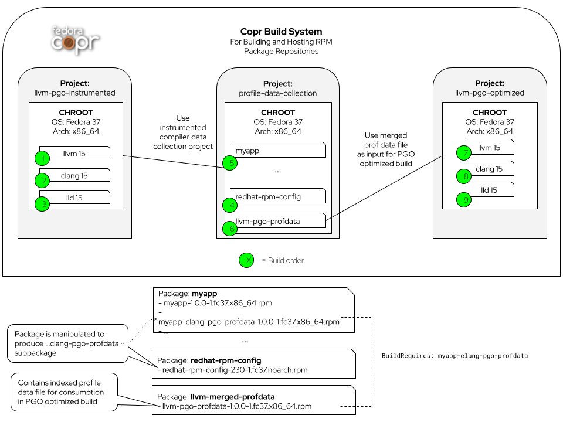

// Process this file with "make docs" before viewing
= A PGO optimized LLVM toolchain for Fedora
Konrad Kleine;
:toc: left
:toclevels: 4
:showtitle:
:sectnums:
:stem:
:sectlinks:
:sectanchors:
:icons: font
:source-highlighter: pygments
:homepage: https://github.com/kwk/pgo-experiment
:link-copr: https://copr.fedorainfracloud.org/[Copr]
:link-fedora: https://getfedora.org/[Fedora Linux]
:link-llvm-pgo-instrumented: https://copr.fedorainfracloud.org/coprs/kkleine/llvm-pgo-instrumented/[kkleine/llvm-pgo-instrumented]
:link-profile-data-collection: https://copr.fedorainfracloud.org/coprs/kkleine/llvm-pgo-instrumented/[kkleine/profile-data-collection]
:link-llvm-pgo-optimized: https://copr.fedorainfracloud.org/coprs/kkleine/llvm-pgo-instrumented/[kkleine/llvm-pgo-optimized]
:link-llvm-pgo-documentation: link:https://llvm.org/docs/HowToBuildWithPGO.html#building-clang-with-pgo[official documentation]

[.lead]
In this experiment I show the steps I took to generate PGO profile data from compiling unmodified RPM packages and feeding those profiles into a PGO optimized rebuild of LLVM.

I created an instrumented LLVM toolchain in a Copr project called {link-llvm-pgo-instrumented}. In another Copr project called {link-profile-data-collection} I build a modified `redhat-rpm-config` package. Every package that gets built in that project will automatically produce a subpackage `<PACKAGE>-clang-profdata` with PGO profile data. I demonstrate this with a simple "Hello, World!" application that is called `myapp`. I then collect all those subpackages through `BuildRequires:` tags in another packaed called `llvm-pgo-profdata`. During the build of that package, all profiles are merged into an indexed profile data file. The final `llvm-pgo-profdata` RPM then installs the indexed profile data file into a location from which a PGO optimized build of LLVM can read it. This PGO optimized build of the LLVM toolchain is done in a third Copr project called {link-llvm-pgo-optimized}.

== Non-goal

It is NOT a goal to get a perfectly tweaked PGO optimization build of LLVM. Instead we want to just show a way how to setup a pipeline in {link-copr} for further tweaking and experimentation.

== Resources

* For building LLVM with PGO: https://llvm.org/docs/HowToBuildWithPGO.html#building-clang-with-pgo
* PGO in general: https://clang.llvm.org/docs/UsersManual.html#profile-guided-optimization

== Understand what PGO can do

> PGO (Profile-Guided Optimization) allows your compiler to better optimize code for how it actually runs. Users report that applying this to Clang and LLVM can decrease overall compile time by 20%.
(link:https://llvm.org/docs/HowToBuildWithPGO.html#introduction[Source])

> Profile information enables better optimization. For example, knowing that a branch is taken very frequently helps the compiler make better decisions when ordering basic blocks. Knowing that a function `foo` is called more frequently than another function `bar` helps the inliner. Optimization levels `-O2` and above are recommended for use of profile guided optimization. [...] [Be] careful to collect profiles by running your code with inputs that are representative of the typical behavior. Code that is not exercised in the profile will be optimized as if it is unimportant, and the compiler may make poor optimization choices for code that is disproportionately used while profiling.
(link:https://clang.llvm.org/docs/UsersManual.html#profile-guided-optimization[Source])

For the {link-fedora} distribution we build a ton of packages with LLVM. The aforementioned *inputs* are these packages themselves. The programs to optimize are those under the LLVM umbrella (e.g. `clang`).

The question is: How can we tap in the RPM build pipeline using {link-copr} and build RPM packages without modifying their `*.spec` files manually?

I've created a 8 step experiment that shows how this can be achieved. For educational purposes I've written many of the steps using `Containerfile` s. This allows for a good level of isolation when you want to build the steps on your own. To run any of the steps on your own, you can run `make build-stepX` where stem:[X \in {0,1,2,...,7}]. But make sure you first read the description for each step below. Sometimes a step really only serves a documentation purpose.

NOTE: The `Containerfile`s run as `root` to allow packages to be installed and have a `tester` account for regular user interaction. Afterall the resulting images are not meant for anything but demonstration purposes and MUST NOT be used in production sites. 

== Steps

=== Step 0 - Build a PGO instrumented LLVM

NOTE: This step mainly exists for documentation purposes. If you *do* build this step on your own, make sure to walk through the files where there's a reference to {link-llvm-pgo-instrumented} and change it to your project. I don't see a need to consider this part of this excersise.

In this step we're going to create PGO instrumented LLVM packages and host them
for later consumption on a Copr project. 

If you want to build this yourself, you need to have a valid Kerberos ticket. Try running:

----
$ kinit <FAS_USER>@FEDORAPROJECT.ORG
----

But rest assured, you don't need to run this on your own. The {link-llvm-pgo-instrumented} project is ready for you to consume in the next steps.

In this step, we're essentially following the {link-llvm-pgo-documentation} for how to build a PGO instumented clang.

The resulting `clang` will generate profile data upon execution and we're trying to collect, bundle, and merge it for optimizing a rebuild of `clang` later. 

=== Step 1 - Build "Hello, World!" RPM

In this step we set the foundation for our experiment.

We have a simply "Hello, World!" application that we build and package as an RPM file.

The other steps build on this simple setup by first adding lines to the RPM spec file that we later want to generalize and finally auto-generate to come back to an unmodified spec file.

Let's have a look at the link:step1/myapp/myapp.spec[specfile] first:

.step1/myapp/myapp.spec
[source,spec,linenum]
----
include::step1/myapp/myapp.spec[]
----

This is the most simple specfile I could come up with for a "Hello, World!" application built with `clang`.

The link:step1/myapp/myapp.cpp[application code] itself is similarly short and throughout this experiment we never change it:

.step1/myapp/myapp.cpp
[source,cpp,linenums]
----
include::step1/myapp/myapp.cpp[]
----

In order to build the RPM we use standard tools like `fedpkg` from a link:step1/myapp/Makefile[`step1/myapp/Makefile`]:

.step1/myapp/Makefile
[source,make,linenums]
----
include::step1/myapp/Makefile[]
----

Within a link:step1/Containerfile[`Containerfile`] we're calling `make rpm` to build the `myapp-1.0.0-1.fc37.x86_64.rpm` RPM:

.step1/Containerfile
[source,dockerfile,linenums]
----
include::step1/Containerfile[]
----

Once the build is done, we stay in the container (see `bash` in the following shell script) and you have to manually exit it (e.g. using `<ctrl>+<d>`). We do this to allow you to look around in the build directories etc.

.step1/entrypoint.sh
[source,shell,linenums]
----
include::step1/entrypoint.sh[]
----

=== Step 2 - Manually add subpackage

In this step we manually add a `myapp-clang-pgo-profdata` subpackage which contains PGO profile data from LLVM. This data is generated by executing a PGO instrumented `clang` from the Copr repo {link-llvm-pgo-instrumented} which we've built in step 0.

The only changes from step1 to step2 are in the the `Containerfile` were we add the PGO instrumented LLVM.

[source,dockerfile]
----
include::step2/Containerfile[tag=install_pgo_instrumented]
----

==== Subpackage definition

We add the subpackage manually in link:step2/myapp/myapp.spec[step2/myapp/myapp.spec].

[source,spec]
----
include::step2/myapp/myapp.spec[tag=manually_add_package]
----
<1> Notice that the added `myapp-clang-pgo-profdata` subpackage requires this file `/usr/lib64/clang-pgo-profdata/myapp/myapp.clang.profdata`. It is a file that we have to create manually by invoking the PGO instrumented `clang`.

==== Set LLVM_PROFILE_FILE

By specifying `export LLVM_PROFILE_FILE="%t/myapp.clang.%m.profraw"` we instruct `clang` to create a raw profile file for each invocation under `TMPDIR` (see `%t` in link:https://clang.llvm.org/docs/SourceBasedCodeCoverage.html#running-the-instrumented-program[the docs]).

.step2/myapp/myapp.spec
[source,spec]
----
include::step2/myapp/myapp.spec[tag=llvm_profile_file]
----

==== Find and merge the profiles

We then find all raw profiles and merge them into the final `myapp.clang.profdata` under the buildroot to be picked up by the `%files` section of the `myapp-clang-pgo-profdata` subpackage:

.step2/myapp/myapp.spec
[source,spec]
----
include::step2/myapp/myapp.spec[tags=find_profiles;merge_profiles]
----

IMPORTANT: Why not store the raw profiles? In the first incarnation of this experiment I did store the raw profiles and I noticed that the final `myapp-clang-pgo-profdata` RPM was 128MB in size. When we first merge the profiles we get it down to ~900KB. I did a similar experiment for the `retsnoop` project and there the effect was also very big: ~1,4GB for raw profile data down to ~1,6MB for merged one.

TIP: You can call `llvm-profdata merge` on already merged profiles!

Now, you may ask why we make the changes to the spec file at all when I promised that we get profile data from unmodified packages. The honest answer is that I didn't know how to do it when I started out this experiment and I found the manual way much more easy to follow along compared to presenting the solution right away. This way we make transparent what needs to be generalized and automated.

In the next step we're generalizing the manual addition of the subpackage before we remove it entirely from the spec file again.

=== Step 3 - Generalize subpackage

In this step we generalize the `myapp-clang-pgo-profdata` subpackage from step 2 to
`%{name}-%{toolchain}-clang-pgo-profdata`.

The only changes from step2 to step3 is in the `myapp/myapp.spec` file:

==== Subpackage definition

.step3/myapp/myapp.spec
[source,spec]
----
include::step3/myapp/myapp.spec[tags=generalize_add_package]
----

==== Set LLVM_PROFILE_FILE

.step3/myapp/myapp.spec
[source,spec]
----
include::step3/myapp/myapp.spec[tags=llvm_profile_file]
----

==== Find and merge profiles

.step3/myapp/myapp.spec
[source,spec]
----
include::step3/myapp/myapp.spec[tags=find_profiles;merge_profiles]
----

You should see that we've replaced all occurrences of `myapp` with the RPM specfile macro `%{name}` and the word `clang` with the `%{toolchain}` macro. That is essentially all we have to do now.

NOTE: You can specify `%global toolchain clang` to have your code compile with clang and use all the right and sane defaults for compiler flags for clang. See https://docs.fedoraproject.org/en-US/packaging-guidelines/#_compiler_macros.

=== Step 4 - Automatically add subpackage

In this step we use the `myapp` directory from `step1` that doesn't contain any information about the subpackage at all. And yet we're still gonna get our subpackage with profile data. We do this by patching, compiling and installing another package that is always present on Fedora: `redhat-rpm-config`. This package is the home of many useful build-flags and macros but it also allows us to tap into the build process by.

==== Toggle

To toggle the profile generation on an off we have defined the `%_toolchain_profile_subpackages`. It is on by default and to disable the generation of profile subpackages you need to specify `%global _toolchain_profile_subpackages %{nil}` this in your specfile.

.step4/redhat-rpm-config/macros
[source,spec]
----
include::step4/redhat-rpm-config/macros[tags=_toolchain_profile_subpackages]
----

IMPORTANT: Currently there's no sanity checking of whether or not a package can even produce PGO profiles. If there's no compiler or the compiler is not clang, my patch doesn't work. But right now we don't care so much about this and consider it an optimization for later. I just wanted to let you know.

=== Subpackage template

The subpackage can be generalized with the following template.

.step4/redhat-rpm-config/macros
[source,spec]
----
include::step4/redhat-rpm-config/macros[tags=subpackage_template]
----

==== Set LLVM_PROFILE_FILE

We export the `LLVM_PROFILE_FILE` environment variable at the right place.

.step4/redhat-rpm-config/macros
[source,spec]
----
include::step4/redhat-rpm-config/macros[tags=set_build_flags]
----

==== Find and merge profiles

We tap in the post-`%install` step to find and merge the profiles into the buildroot location.

.step4/redhat-rpm-config/macros
[source,spec]
----
include::step4/redhat-rpm-config/macros[tags=find_and_merge_profiles;post_install]
----

==== Build redhat-rpm-config package

In order to build the `redhat-rpm-config` we build the package using `fedpkg local`. Then we can simply imstall the resulting RPM using `dnf`:

.step4/entrypoint.sh
[source,shell]
----
include::step4/entrypoint.sh[tags=build_patched_redhat_rpm_config]
----

NOTICE: There's no `step4/myapp` directory. This is because we copy it from step1 in the top-level link:Makefile[`Makefile`]. This is supposed to emphasize the point that we don't modify the spec file:

.Makefile
[source,make]
----
include::Makefile[tags=build_step_4]
----

=== Step 5 - Build unmodified packages on Copr

NOTE: You don't need to run this step manually. It has already been run and the results are in the Copr project
{link-profile-data-collection}.

Up until this point all of our experiments look promising but how can we use Copr to build packages and produce `<PACKAGE>-clang-profdata` packages automatically for us? 

Copr will become the storage for our profile data subpackages with all the rest of the regular packages.

After running this step using `make build-step5`, we're gonna have a project called: {link-profile-data-collection}.

In that project, there will be the patched `redhat-rpm-config` package and the `myapp` package with the additional subpackage inside:

image::profile-data-collection.png[]

In order for the Copr project to use our PGO instrumented LLVM we've made the repo available in the link:step5/Makefile[`step5/Makefile`] using the `--repo` option:

.step5/Makefile
[source,make]
----
include::step5/Makefile[tags=create_copr_project]
----

Any package that will be built after `redhat-rpm-config` in the {link-profile-data-collection} Copr project will automatically have a `<package>-clang-profdata` subpackage that we can download in a later step to merge and feed it in the final, optimized build of LLVM.

==== Optional: Build from distgit

If you're curious, you can build any project from Fedora's distigt by doing

[source,console]
----
$ cd step5/
$ make distgit-retsnoop
----

This is backed by this special target in the link:step5/Makefile[`step5/Makefile`]:

.step5/Makefile
[source,make]
----
include::step5/Makefile[tags=build_from_disgit]
----

NOTE: You might wonder why we first add and then edit a package. This is because we don't know if the package has already been added before. And to overwrite with the desired values we simply edit an added project right away. So, nothing really special.  

=== Step 6 - Merge Raw Profiles

In order to optimize LLVM with the raw profile data that we've collected before we need to make it available to the Copr build of LLVM and we need to link:https://llvm.org/docs/CommandGuide/llvm-profdata.html#profdata-merge[merge] it using `llvm-profdata merge`.

Merging takes "[...] takes several profile data files generated by PGO instrumentation and merges them together into a single indexed profile data file."

The `<PACKAGE>-clang-profdata` packages that we've build so far are installable standalone. When we build a PGO optimized version of LLVM we add a `BuildRequires: myapp-clang-pgo-profdata` to the spec file of a new package called `llvm-pgo-profdata`.

.step6/llvm-pgo-profdata/llvm-pgo-profdata.spec
[source,spec]
----
include::step6/llvm-pgo-profdata/llvm-pgo-profdata.spec[tags=build_requires]
----

The spec file merges the profiles provided by the above`<PACKAGE>-clang-pgo-profdata` packages to create a single PGO profile data file that we can later use for building a PGO optimized LLVM toolchain.

.step6/llvm-pgo-profdata/llvm-pgo-profdata.spec
[source,spec]
----
include::step6/llvm-pgo-profdata/llvm-pgo-profdata.spec[tags=merge_profiles;installed_profile_data]
----

[CAUTION]
====
The `llvm-pgo-profdata` package will be build on Copr in the {link-profile-data-collection} project and as you may recall from earlier, we have our patched `redhat-config-rpm` package living there as well. That means by default the `llvm-pgo-profdata` is expected to output PGO profiles. In reality it doesn't do that and so we're  disabling the profile generation manually:

.step6/llvm-pgo-profdata/llvm-pgo-profdata.spec
[source,spec]
----
include::step6/llvm-pgo-profdata/llvm-pgo-profdata.spec[tags=disable_pgo_data_generation]
----
====

In Fedora as well as RHEL and CentOS Stream we use a mode call "standalone-build". That means, we're building each sub-project of LLVM (e.g. `clang`, `llvm`, `lld`) with its own specfile. To avoid merging the PGO profile data into an indexed profile data file more than once we're offloading the merge process into its own RPM. We call it `llvm-pgo-profdata`. 

=== Step 7 - Build PGO optimized LLVM

This step is similar to step 0 in which we've build the PGO instrumented LLVM. Here we're adding a build requirement for `llvm-pgo-profdata` and use the file `%{_libdir}/%{toolchain}-pgo-profdata/llvm-pgo.profdata` as input to `LLVM_PROFDATA_FILE` for the optimization of the `llvm`, `clang` and `lld` packages.

The resulting PGO optimized packages are available on {link-llvm-pgo-optimized}.

== Conclusion

We've seen how we can gather PGO profile data and feed it into a PGO optimized recompilation of LLVM. I hope you liked this article and follow us exploring the possibilities ahead of us! Don't forget to leave a comment ;)

// == Open questions:
// 
// * What happens to packages that don't use `%global toolchain clang`? - Not important right now
// * Outlook: Move redhat-rpm-config stuff into clang-instrument-macros or alike.
// * Performance benefits: any profile is good?